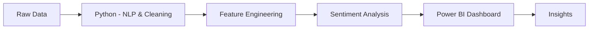

# 🖤 Sentiment Analysis of X (Twitter) Data

### 📊 End-to-End Data Analytics Project

<p align="center">
  
  
  
</p>

---

## 🎯 Project Summary

This project demonstrates a complete **Sentiment Analysis workflow**, where raw social media data is transformed into **meaningful insights** using Python and interactive dashboards.

It highlights my ability to:

* Perform **text preprocessing using NLP techniques**
* Build and analyze sentiment data
* Engineer features for deeper insights
* Create **interactive Power BI dashboards**
* Communicate insights effectively

---

## 🎨 Dashboard Preview

<p align="center">
  
</p>

---

## 🚀 Key Metrics

| Metric                     | Value  |
|--------------------------|--------|
| 📝 Total Tweets           | 16K+   |
| 😊 Positive Sentiment     | 55%    |
| 😡 Negative Sentiment     | 25%    |
| 😐 Neutral Sentiment      | 20%    |
| ⚠️ Issue-related Tweets   | 18%    |

---

## 📊 Insights Snapshot

* 📈 Majority of tweets show **positive sentiment**
* 🧾 Negative tweets are generally **longer and more detailed**
* ⚠️ A portion of tweets highlight recurring issues
* ☁️ Frequent keywords reveal **trending topics**
* 🔍 Sentiment distribution reflects overall public opinion

---

## 🔄 Workflow



---

## 🛠️ Tech Stack
<p align="center">   </p>

---

## 📂 Repository Structure

```bash
├── data/
│   ├── Twitter_Data.csv
│   └── cleaned_twitter_data.csv
│
├── notebooks/
│   ├── datacleaning2.ipynb
│   ├── twittersentimentanalysis.ipynb
│   └── wordcloud.ipynb
│
├── dashboard/
│   └── twitter_dashboard.pbix
│
├── reports/
│   └── sentiment analysis report.docx
│
├── images/
│   └── wordcloud_white.png
│
└── README.md
```

---

## ⚙️ Setup Instructions

### 1️⃣ Clone Repository

```bash
git clone https://github.com/samikshapawar08/x-sentiment-analysis.git
```

### 2️⃣ Run Python Notebook

* Open Jupyter Notebook
* Execute all cells

### 3️⃣ Generate Word Cloud

* Run Python code
* Export wordcloud.png

### 4️⃣ Dashboard

* Open .pbix in Power BI
* Load cleaned dataset
* Explore visuals

---

## 📚 Key Learnings

✔️ NLP-based text preprocessing

✔️ Working with real-world noisy data

✔️ Feature engineering

✔️ Dashboard storytelling

✔️ Python + Power BI integration

---

## 🔮 Future Improvements

## 🔮 Future Improvements

*  Implement advanced NLP models such as BERT and LSTM for improved sentiment accuracy
  
*  Develop a real-time sentiment analysis pipeline using streaming data
  
*   Perform topic modeling to uncover hidden themes in customer reviews
    
*  Build an interactive UI/dashboard for better user experience and visualization  

---

## 🤝 Connect With Me

<p align="center">
  <a href="www.linkedin.com/in/samiksha-pawar-aa1018266"></a>
  <a href="#"></a>
</p>

---

## ⭐ Support

If you like this project, consider giving it a ⭐ on GitHub!

---

<p align="center">
  <b>“Turning Data into Decisions 📊”</b>
</p>
